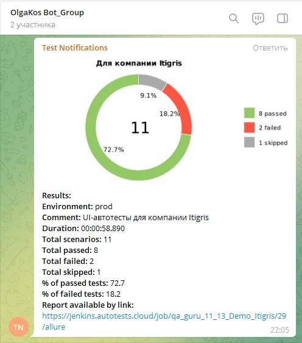

# Проект по автоматизации тестирования сайта Itigris
:earth_americas: https://itigris.com

## Содержание:
- [Технологии и инструменты](#watermelon-технологии-и-инструменты)
- [Реализованные проверки](#watermelon-Реализованные-проверки)
- [Запуск из терминала](#watermelon-Запуск-тестов-из-терминала)
- [Запуск тестов в Jenkins](#watermelon-Запуск-тестов-в-Jenkins)
- [Allure отчет](#bellhop_bell-Allure-отчет)
- [Видео прохождения тестов](#watermelon-Видео-прохождения-тестов)
- [Отчет в Telegram](#bellhop_bell-Отчет-в-Telegram)


## :watermelon: Технологии и инструменты

<p align="center">
<a href="https://www.jetbrains.com/idea/"></a>
<a href="https://www.java.com/"></a>
<a href="https://github.com/"></a>
<a href="https://junit.org/junit5/"></a>
<a href="https://gradle.org/"></a>
<a href="https://selenide.org/"></a>
<a href="https://aerokube.com/selenoid/"></a>
<a href="https://github.com/allure-framework/allure2"></a>
<a href="https://www.jenkins.io/"></a>
<a href="https://www.хххх/"></a>
</p>

Перечень технологий и инструментом, использованных при реализации этого проекта:
- автотесты написаны на языке `Java`
- для UI-тестов используется тестовый фреймворк `Selenide`
- Для сборки проекта используется `Gradle`
- Библиотека для модульного тестирования: `JUnit 5`
- `Jenkins` выполняет удаленный запуск тестов в визуальном-онлайн интерфейсе. Установки дополнительных приложений на компьютер пользователя не требуется.
- `Selenoid` демонстрирует пример запуска браузеров в контейнерах Docker (и записывает видео).
- `Allure Report` формирует наглядный графический отчет о результатах  запуска тестов.
- После завершения прогона тестов, специальный `Telegram Bot` отправляются в `Telegram` краткий вариант Allure Report

## :watermelon: Реализованные проверки
Примеры UI тестов:
- [✓] Проверка текстов на странице Team
- [✓] Проверка названия в карточке кейса Essilor
- [✓] Заполнение формы обратной связи
- [✓] Закрытие всплывающего окна
- [✓] Поиск 1 товара
- [✓] Поиск нескольких товаров. Проверка результатов для запроса (2)
- [х] Поиск по части наименования. Проверка результатов для запроса (3)
- [✓] Пример пропущенного теста (Skipped)

## :watermelon: Запуск тестов из терминала
Шаги:
1. Открыть терминал
2. Запустить на выполнение команду:
###### Локальный запуск:
```
gradle clean test
```
###### Удаленный запуск:
```
clean
test
-Dbrowser=${BROWSER}
-DbrowserVersion=${BROWSER_VERSION}
-DbrowserSize=${BROWSER_SIZE}
-DremoteDriverUrl=https://user1:1234@${REMOTE_BROWSER}/wd/hub/
-DvideoStorage=https://${REMOTE_BROWSER}/video/
-Dthreads=${THREADS}
```

## :watermelon: Запуск тестов в Jenkins
Шаги:
1. Зарегистрированным пользователем перейти на страницу сборки проекта по ссылке: <a target="_blank" href="https://jenkins.autotests.cloud/job/qa_guru_11_13_Demo_Itigris/">Jenkins Itigris</a>
2. Перечисленные ниже параметры можно менять в графическом интерфейсе.
3. Запустить выполнение тестов кнопкой "Собрать" (внизу страницы)

Основные параметры сборки:
- `BROWSER` – браузер, в котором будут выполняться тесты (по умолчанию - Chrome).
- `BROWSER_VERSION` версия браузера, в которой будут выполняться тесты (по умолчанию - 91.0).
- `BROWSER_SIZE` – размер окна браузера, в котором будут выполняться тесты (по умолчанию - 1920x1080).
- `REMOTE_BROWSER` - адрес (логин и пароль) удаленного сервера (Selenoid), на котором будут запускаться тесты.
- `THREADS` - кол-во потоков

Дополнительные параметры сборки, задействованные для выгрузки краткого отчета в Telegram:
- `PROJECT_NAME`  название проекта
- `ENVIRONMENT` - тестовый стенд (prod, preprod, stage...), на котором запускались тесты. <i>В примере эти данные не заданы. Можно выставить любое значение из доступных в выпадающем списке</i>.
- `COMMENT` - ваш текстовой комментарий
- `BUILD_URL` - автоматическая ссылка на детализированный отчет о сборке

## :bellhop_bell: Allure отчет
После того как тесты завершились, можно получить визуальный Allure отчет.
<br>Способ 1: Сформировать отчет средствами IJ IDEA (Allure Serve)
<br>Способ 2:
<br>1. Выполнить сборку в Jenkins
<br>2. Убедиться, что в блоке История сборок (напротив номера #) появился желтый значок Allure Report
<br>3. Кликнуть по значку Allure Report
<br>Ожидаемый результат: Откроется страница с готовым Allure Report

###### Главная страница Allure-отчета содержит следующие информационные блоки:
- `ALLURE REPORT` отображает: Дату и время прохождения теста. Общее количество пройденных кейсов. Диаграмму с указанием процента и количества успешных, упавших и сломавшихся в процессе выполнения тестов
- `TREND` - отображает тренд прохождения тестов от сборки к сборке
- `SUITES` - отображает распределение результатов тестов по тестовым наборам
- `ENVIRONMENT` - отображает тестовое окружение (стенд), на котором запускались тесты. <i>В данном примере информация не задана.</i>
- `CATEGORIES` - отображает распределение неуспешно прошедших тестов по видам дефектов
- `FEATURES BY STORIES` - отображает распределение тестов по функционалу, который они проверяют
- `EXECUTORS` - отображает исполнителя текущей сборки (ссылка на сборку в Jenkins)

###### Главный экран отчета (Owerwiev)
<p align="center">

</p>

###### Страница с проведенными тестами (Suites)
<p align="center">

</p>

## :watermelon: Видео прохождения тестов
К каждому тесту (в отчете) прилагается автоматически сгенерирвонное Selenoid видео. Пример:
<p align="center">
  
</p>

## :bellhop_bell: Отчет в Telegram
После завершения сборки специальный Telegram-бот отправляет сообщение с отчетом о прогоне тестов.
Чтобы видеть сообщения от бота, вступите (временно) в телеграм-группу `OlgaKos Bot_Group`

<p align="center">

</p>

-------
ver 2022-03-29
